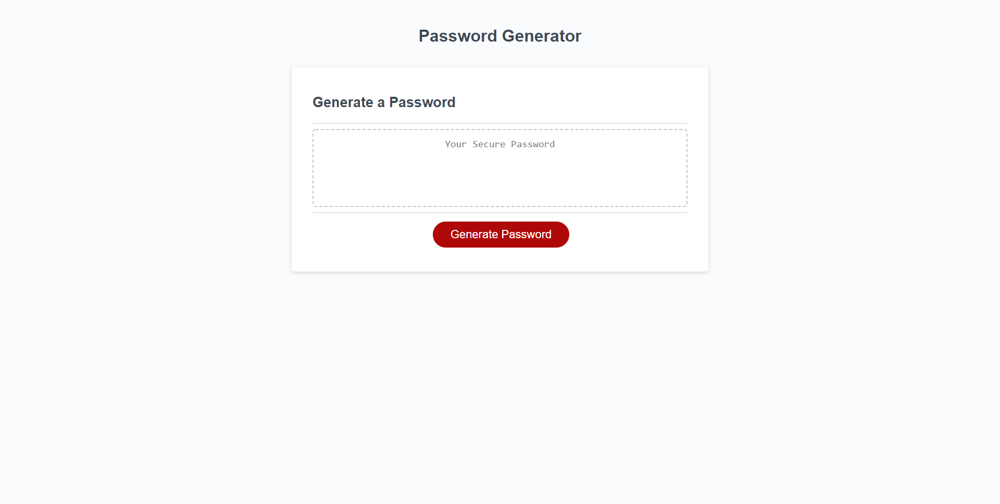

# Password Generator

## Description

This is a password generator that can be used to generate a random passworrd between 8 and 128 charcters.  Users can choose whether to include uppercase letters, numbers, or special characters in their password.  If none of these characters are chosen, the password will only contain lowercase letters. The password generator can be used repeatedly by pressing the "Generate Password" button to initiate the user prompts.

## Languages Used

- HTML
- CSS
- JavaScript

## Screenshot
   

## Deployment Link

https://uncgirl02.github.io/password-generator/
